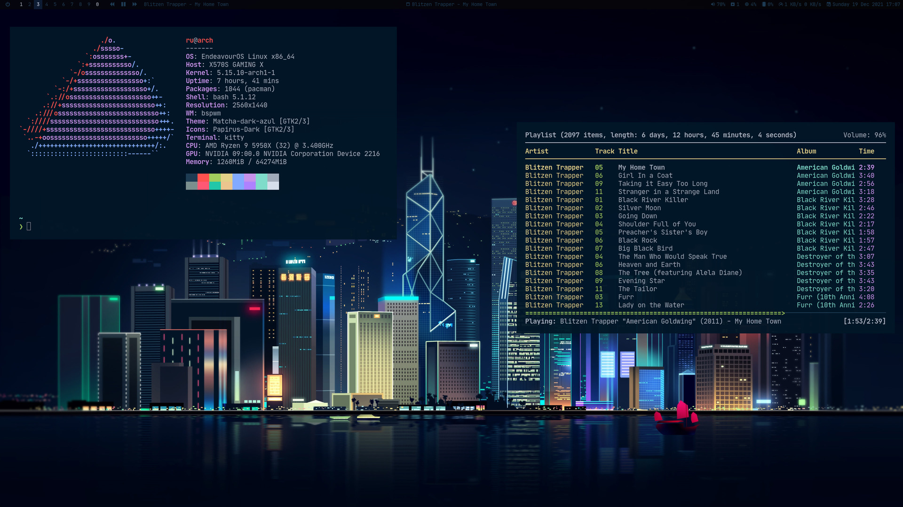

## Hello World 👋

- Forever learning all the things! 📚
- A huge fan of OpenBSD 🐡 and GNU/Linux 🐧
- I often tweak .dotfiles ⏳ and dream of traveling ✈️

🧐 [about.me][aboutme] **|** 
🏡 [website][website] **|** 
🐦[twitter][twitter] **|** 
📺 [youtube][youtube] **|** 
📷 [instagram][instagram]  
👔 [linkedin][linkedin] **|**
🐙 [gists][gists] **|**
📦 [codepen][codepen] **|**
⚔️ [cssbattle][cssbattle] **|**
🏗️ [patreon][patreon]

[aboutme]: https://about.me/ruandre
[website]: https://ruandre.com
[twitter]: https://twitter.com/ruandre
[youtube]: https://youtube.com/ruandrejvr
[instagram]: https://instagram.com/ruandrejvr
[linkedin]: https://linkedin.com/in/ruandre
[gists]: https://gist.github.com/ruandre/
[codepen]: https://codepen.io/ruandre
[cssbattle]: https://cssbattle.dev/player/ruandre
[patreon]: https://www.patreon.com/ruandre

#### 🍚 Rice:

_(plan on eventually uploading dotfiles)_

